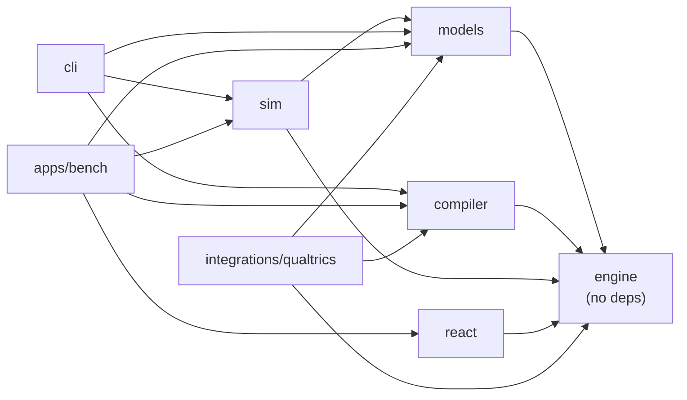

# DOSE Bench

TypeScript implementation of **DOSE** (Dynamically Optimized Sequential Experimentation), the Bayesian adaptive method for eliciting
individual risk, loss and time preferences introduced by Chapman, Snowberg, Wang & Camerer.

DOSE keeps a posterior over a person's preference parameters and, after every answer, asks the binary question with the highest
expected information gain. Ten simple choices give estimates about twice as accurate as a multiple price list, and the method
accounts for mistakes instead of breaking on them.

This repo makes it runnable anywhere:

- **Live in the browser.** Question selection and Bayes updates run on the participant's device in a few milliseconds, with no server.
- **Precompiled.** The same engine compiles every path into a static JSON tree for panels that can't run code mid-survey.
- **Verified.** Seeded recovery simulations reproduce the paper's accuracy gap and run as regression tests.

## Packages

| Package                                            | What it is                                                                                                                       |
| -------------------------------------------------- | -------------------------------------------------------------------------------------------------------------------------------- |
| [`@dose-bench/engine`](packages/engine)            | Zero-dependency core: grid prior, likelihood tables, information-gain selection, Bayes update, `DoseSession`, ex-post re-fitting |
| [`@dose-bench/models`](packages/models)            | Presets: prospect-theory risk & loss; quasi-hyperbolic time, with ρ fixed or estimated jointly                                   |
| [`@dose-bench/compiler`](packages/compiler)        | `compileTree` → `dose-tree/1` JSON, `treeWalker`, zod schemas for tree and trace files                                           |
| [`@dose-bench/sim`](packages/sim)                  | Parameter-recovery harness with random-order and double-MPL baselines                                                            |
| [`@dose-bench/react`](packages/react)              | `useDoseSession`, `DoseModule`, unstyled `ChoiceCard` with optional plain-CSS theme                                              |
| [`@dose-bench/cli`](apps/cli)                      | `dose compile`, `dose recover`, `dose fit`, `dose validate`                                                                      |
| [`apps/bench`](apps/bench)                         | The DOSE Bench web app (Vite, React 19, Tailwind v4, shadcn/ui)                                                                  |
| [`integrations/qualtrics`](integrations/qualtrics) | 14 KB IIFE build (`window.DOSE`) and a copy-paste Qualtrics question                                                             |



## Quick start

```sh
pnpm install
pnpm dev             # DOSE Bench at http://localhost:5173/run/risk-loss
pnpm test            # all packages
pnpm dose recover risk-loss --n 400
```

Run a module in your own page:

```ts
import { DoseSession, createEngine } from "@dose-bench/engine";
import { riskLossModel } from "@dose-bench/models";

const engine = createEngine(riskLossModel());
const session = new DoseSession(engine, { length: 10, sides: "random" });

const item = session.next(); // { question, text: { a, b }, swapped, gainBits, ... }
session.answer(true); // participant chose option A (or session.choose("left"))
session.estimate().params.lambda; // { mean, sd, median, ci90, marginal }
const trace = session.trace(); // dose-trace/2 record: save it after every answer
DoseSession.resume(engine, trace); // after a page reload, carry on from the same question
```

Or in React:

```tsx
import { DoseModule } from "@dose-bench/react";
import "@dose-bench/react/styles.css";

<DoseModule engine={engine} length={10} onAnswer={saveDraft} onComplete={(trace) => save(trace)} />;
```

## How it compares

`dose recover risk-loss --n 400 --seed 7`, 10 questions, the paper's parameter ranges. Inaccuracy is |estimate − truth| / truth, the
paper's measure:

|                            | ρ inaccuracy | λ inaccuracy | λ rank correlation |
| -------------------------- | ------------ | ------------ | ------------------ |
| DOSE                       | **14%**      | **19%**      | **0.92**           |
| Random question order      | 23%          | 61%          | 0.66               |
| Double multiple price list | 20%          | 33%          | 0.82               |

The price list could not produce λ for 10% of simulated people, whose answers imply a dominated choice. The paper reports 21% vs 36%
inaccuracy and 11% failures. For time preferences, DOSE's δ error is 4% against 10% for random order. Choice consistency (μ) is weakly
identified by any 10-question design, as the paper notes.

Speed, on a laptop-class CPU: building the risk & loss likelihood table (3,840 grid points × 240 questions) takes about 0.2 s once per
page; choosing each question takes 2–5 ms; compiling a full 10-question tree (2,047 nodes, 103 KB) takes about 2 s.

## Deploying a study

| Setting                                   | Use                                                                                                                                  |
| ----------------------------------------- | ------------------------------------------------------------------------------------------------------------------------------------ |
| Your own web page, jsPsych, lab.js, oTree | `@dose-bench/engine` + `@dose-bench/models`, or `@dose-bench/react`                                                                  |
| Qualtrics                                 | [`integrations/qualtrics`](integrations/qualtrics)                                                                                   |
| Panels that block custom JavaScript       | `dose compile … --out tree.json`, then display logic or `treeWalker`                                                                 |
| Re-analysis                               | `fitTrace(model, trace)` or `dose fit <model> trace.json` re-estimates stored answers under any model that prices the same questions |

Nothing here stores participant data. Your survey platform keeps the `dose-trace/2` records, which keeps the ethics and data-residency
story simple.

## Development

```sh
pnpm typecheck       # tsc --noEmit in every package
pnpm test            # vitest across the workspace
pnpm build           # tsup for libraries, vite for the app, IIFE for Qualtrics
pnpm format          # prettier
pnpm changeset       # describe a change to a published package
```

Packages resolve each other's TypeScript source through a private `dose-bench-source` export condition, so tests, typechecks and the dev server need
no build step. See [docs/ARCHITECTURE.md](docs/ARCHITECTURE.md) for the maths, the data formats and how to add a model, and
[CONTRIBUTING.md](CONTRIBUTING.md) for the workflow.

## Status and limits

- The question space is a reconstruction from the paper's description. The authors' exact question trees are available from them on
  request; results will differ slightly until they are used.
- Adaptive designs are not strictly incentive compatible. The paper pays one random question and cites evidence that gaming is rare.
  PRINCE-style payment (Johnson et al. 2021) is on the roadmap.
- Planned: EC² selection criterion, probability-weighting and WTP models (cf. DOSE-CV), Qualtrics display-logic export, carrying the
  risk-module posterior into the time module as a prior.

## Citing

If you use this software, cite the method paper and this repository. See [CITATION.cff](CITATION.cff).

> Chapman, J., Snowberg, E., Wang, S. W., & Camerer, C. (2024). _Dynamically Optimized Sequential Experimentation (DOSE) for Estimating
> Economic Preference Parameters._ NBER Working Paper 33013.

## Licence

MIT. This is an independent implementation, not affiliated with the method's authors.
